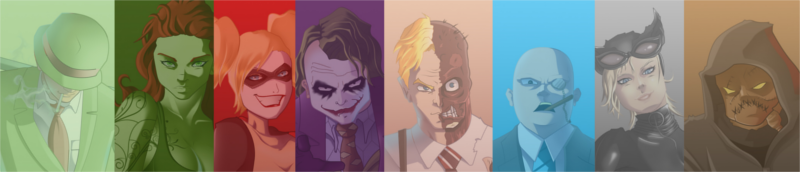

 ### Arkham Asylum Massive Escape!

There was a mass escape from Gotham City's maximum security penitentiary this dawn. There is still no knowledge of how many detainees escaped from the complex, but not official informations indicates that 8 supervillains are fugitives.

_Question, Poison Ivy, Harley Quinn, Joker, Two Face, Penguin, Cat Woman and Scarecrow_

According to commissioner James Gordon from [GCPD](//en.wikipedia.org/wiki/Gotham_City_Police_Department), the cells showed no signs of break-in, and only a few playing cards were found.

_"During the night round some officers reported a strange stillness in the corridors of the maximum security block. They went to check and in their last radio report they said that some cells were empty, after that they did not respond anymore. This morning they were found near the cells raving and with a smile on their faces. Some playing cards was also found." - James Gordon_

Until now, there are no reports of occurrences related to the escape.
